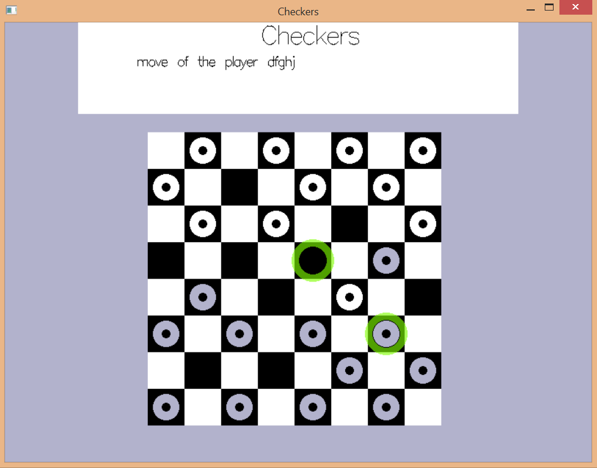
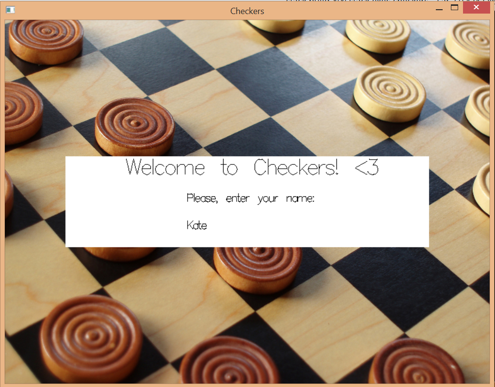
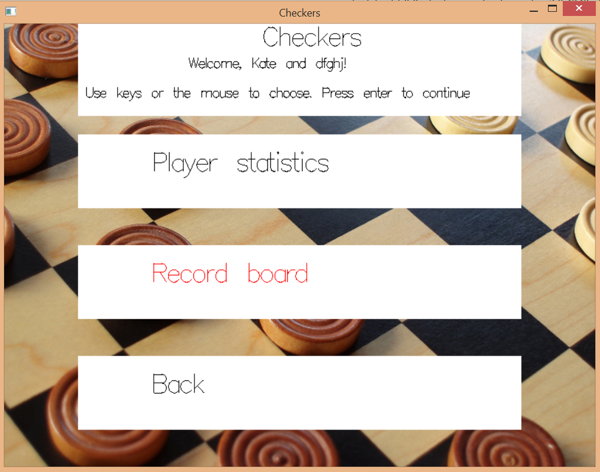

# checkers


[](https://travis-ci.org/cmc-haskell-2016/checkers)

## Скриншоты

### Игра


### Стартовая страница


### Меню статистики



## Установка и запуск

Для установки клонируйте репозиторий и соберите проект с помощью `stack`:

```
git clone https://github.com/cmc-haskell-2016/checkers.git
cd checkers
stack setup
stack build
```

После установки запуск осуществляется командой `stack exec`:

```
stack exec checkers
```

Во время разработки инициировать повторную сборку проекта с последующим запуском рекомендуется
следующей командой:

```
stack build && stack exec checkers
```
